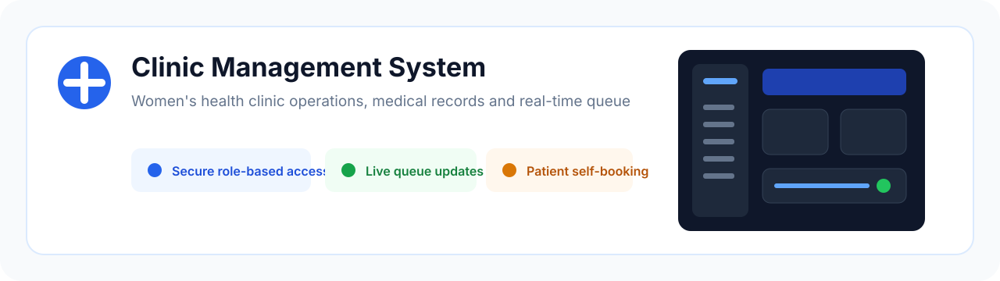
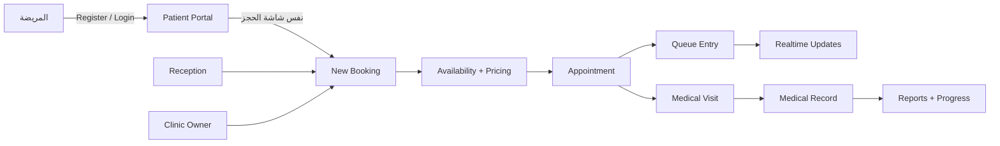
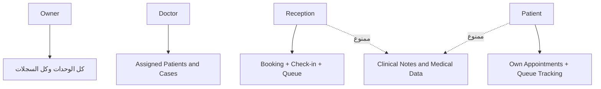
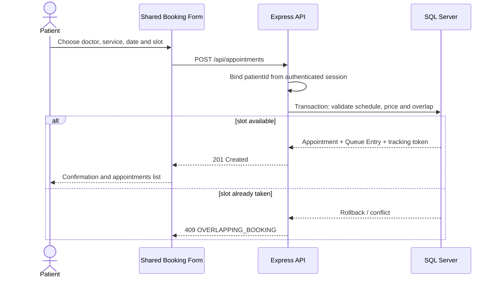
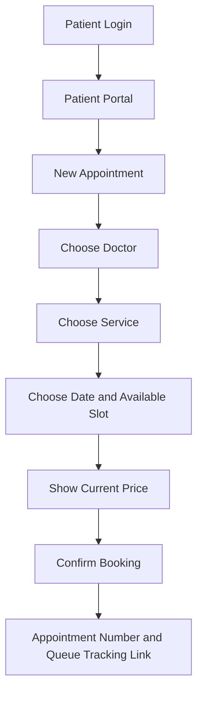

# Clinic Management System

  <picture>
    <source media="(prefers-color-scheme: dark)" srcset="docs/assets/clinic-banner-dark.svg">
    <source media="(prefers-color-scheme: light)" srcset="docs/assets/clinic-banner-light.svg">
    
  </picture>

  <strong>نظام تشغيل متكامل لعيادة نساء وتوليد متعددة الأطباء</strong> 
  حجز · استقبال · طابور لحظي · سجل طبي منظم · متابعة الحمل · تقارير · صلاحيات آمنة

  
  

  
  
  
  
  

> **الحالة الحالية:** التسجيل الذاتي للمريضة يعمل بالبريد الإلكتروني وكلمة المرور **بدون OTP**، والمريضة تستطيع الآن إنشاء حجز لنفسها من نفس شاشة الحجز المستخدمة بواسطة الـReception، مع تطبيق قواعد الـAvailability وDouble Booking من الـBackend.

## روابط سريعة

| الرابط | الاستخدام |
|---|---|
| [التجربة المباشرة](https://clinic-seven-sand.vercel.app) | النسخة المنشورة على Vercel |
| [الإنتاج البديل](https://clinic-paaf.vercel.app) | رابط Vercel بديل |
| [دليل التشغيل الكامل](docs/PROJECT_GUIDE.md) | الـflows، الصلاحيات، الـAPI، قاعدة البيانات، النشر وحل المشاكل |
| [النماذج الطبية الواقعية](docs/medical-forms/) | مراجع وحقول Patient History وGynecology وAntenatal وUltrasound وغيرها |
| [GitHub Repository](https://github.com/AhmedSalem104/Clinic) | الكود، الإصدارات ونسخة README الحالية |

## فهرس الدليل

- [نظرة سريعة](#نظرة-سريعة)
- [الهدف والكيانات الأساسية](#الهدف)
- [المستخدمون والصلاحيات](#المستخدمون-والصلاحيات)
- [تسجيل المريضة والحجز الذاتي](#patient-registration-بدون-otp)
- [الحجز والطابور والـRealtime](#queue-management)
- [السجل الطبي والنماذج](#السجل-الطبي)
- [المعمارية والـAPI](#المعمارية)
- [قاعدة البيانات والأمان](#قاعدة-البيانات)
- [التشغيل المحلي والنشر](#التشغيل-المحلي)
- [الحدود الحالية وDefinition of Done](#الحدود-الحالية)

## نظرة سريعة

هذا المشروع ليس صفحة حجز منفردة؛ هو **Clinic Operating System** يفصل التشغيل اليومي عن السجل الطبي، ويعطي كل مستخدم واجهة وصلاحيات تناسب دوره.

| ما تم تسليمه | النتيجة العملية |
|---|---|
| Patient Registration بدون OTP | إنشاء حساب مريضة وربطه بسجل Patient داخل Transaction واحدة |
| Patient Self-booking | اختيار الطبيب والخدمة والتاريخ والـslot والسعر من نفس New Booking Flow |
| Booking Security | إجبار `patientId` و`BookingSource=online` من جلسة المريضة، وعدم قبول حجز مريضة أخرى |
| Queue & Tracking | Queue Entry وPublic Tracking Token وEstimated Waiting Time |
| Clinical Separation | Appointment منفصل عن Visit، وCase منفصل عن Pregnancy، وبيانات Structured قابلة للتقارير |
| Role-based Access | Owner وDoctor وReception وPatient مع Server-side checks وAudit Logs |
| Modular Stack | HTML/CSS/Vanilla JS/Tailwind + Node/Express + SQL Server/mssql |

### خريطة النظام في لقطة واحدة

### ما الذي يراه كل دور؟

<strong>افتح رحلة الحجز الذاتي خطوة بخطوة</strong>

1. المريضة تسجل الدخول بالبريد وكلمة المرور.
2. تضغط **Book a new appointment** من Patient Portal.
3. تختار الطبيب، الخدمة، التاريخ والـslot الظاهر كمتاح.
4. يظهر السعر الحالي حسب Doctor + Service.
5. يؤكد الـBackend أن الـslot ما زال متاحًا داخل Transaction.
6. يتم إنشاء Appointment وQueue Entry عند احتياج الخدمة للطابور.
7. تعود المريضة إلى Portal لترى الموعد ورقم الدور ورابط المتابعة.

## الهدف

النظام يفصل بين الكيانات التالية:

- Appointment: ما تم حجزه.
- Queue Entry: دور المريضة داخل طابور الطبيب.
- Visit: ما حدث طبيًا بالفعل.
- Medical Case: حالة مستقلة مثل PCOS أو Pregnancy.
- Pregnancy: سجل حمل مستقل مرتبط بحالة ومتابعات ونتيجة ولادة.
- Patient Account: حساب دخول مرتبط بسجل Patients من خلال PatientId.

الأهداف التشغيلية:

1. تقليل وقت الانتظار.
2. إعطاء المريضة Estimated Time وPeople Ahead.
3. تمكين الـReception من إدارة الحجز الهاتفي والـWalk-in.
4. وصول الطبيب إلى التاريخ الطبي المسموح به بسرعة.
5. حماية البيانات الطبية الحساسة.
6. دعم أكثر من طبيب داخل نفس العيادة.

## المستخدمون والصلاحيات

| المستخدم | ما يفعله | ما لا يراه |
|---|---|---|
| Clinic Owner | كل المرضى والأطباء والخدمات والأسعار والجداول والحجوزات والطابور والسجل الطبي والتقارير والمستخدمون والإعدادات وAudit Logs | لا توجد قيود تشغيلية داخل نطاقه |
| Doctor | المرضى والحالات المعيّنة له، Visits، Pregnancy، Medications، Allergies، Labs، Ultrasound، Documents، Progress والتقارير | مرضى غير Assigned له وإدارة المستخدمين |
| Reception | البحث، Add Patient، Booking، Phone Booking، Walk-in، Check-in، Queue، No Show، Cancel، Reschedule، Pause/Resume | Diagnosis وClinical Notes وتفاصيل الحمل والأدوية والتقارير الطبية |
| Patient | إنشاء حساب بدون OTP، Login، Patient ID، حجز موعد لنفسها من شاشة الحجز المشتركة، رؤية مواعيدها، حالة الموعد، متابعة الدور | السجل الطبي وDashboard العيادة ومرضى آخرون وإدارة الطابور والحجز باسم مريضة أخرى |

~~~mermaid
flowchart LR
  Owner[Clinic Owner] --> All[All Modules]
  Doctor[Doctor] --> Assigned[Assigned Patients and Cases]
  Doctor --> Clinical[Clinical Records and Reports]
  Reception[Reception] --> Operations[Booking and Queue]
  Reception -. denied .-> Clinical
  Patient[Patient] --> Portal[Appointments and Queue Tracking]
  Patient -. denied .-> Clinical
~~~

صلاحيات الـBackend هي طبقة الحماية الأساسية، وليس إخفاء الزر في الواجهة.

## Patient Registration بدون OTP

### الدخول

من Login اضغط:

~~~text
إنشاء حساب مريضة جديد
~~~

أو افتح:

~~~text
/patient-register.html
~~~

### الحقول

| الحقل | الحالة | الاستخدام |
|---|---|---|
| Full Name | Required | الاسم الظاهر في الحجوزات |
| Date of Birth | Optional | كشف التكرار وحساب العمر |
| Phone | Required | البحث والتواصل وكشف التكرار |
| Email | Required | اسم الدخول الفريد |
| Password | Required، 8 أحرف على الأقل | bcrypt hash |
| Confirm Password | Required | منع أخطاء الإدخال |
| Preferred Contact Channel | Optional | Phone أو SMS أو WhatsApp |
| Alternate Phone | Optional | قناة احتياطية |
| Address | Optional | بيانات تشغيلية |
| Emergency Contact | Optional | اسم ورقم جهة الطوارئ |
| Consent | Required | الموافقة على إنشاء الحساب واستخدام بيانات التواصل |

لا يوجد OTP أو رمز تحقق، لذلك البريد والهاتف لا يعتبران موثقين تلقائيًا.

### Flow التسجيل

~~~mermaid
sequenceDiagram
  actor Patient as Patient
  participant UI as Registration Page
  participant API as Patient Portal API
  participant DB as SQL Server

  Patient->>UI: Fill registration form
  UI->>API: POST JSON without OTP
  API->>API: Validate and rate limit
  API->>DB: Begin transaction
  DB->>DB: Check email, phone and name plus DOB
  alt duplicate
    DB-->>API: 409 conflict
    API-->>UI: Contact clinic message
  else new identity
    DB->>DB: Insert Patient
    DB->>DB: Insert User with Role patient
    DB->>DB: Commit and Audit Log
    API-->>UI: 201 PatientCode
  end
~~~

### منع التكرار

يرفض النظام التسجيل إذا:

- البريد موجود في Users.
- الهاتف بعد التطبيع موجود في Patients.NormalizedPhone.
- الاسم المطبع مع تاريخ الميلاد يطابق سجلًا موجودًا.

لا يتم الدمج التلقائي مع سجل قديم، لأن التسجيل بدون OTP لا يثبت ملكية الهاتف. يقوم موظف العيادة بالمراجعة والربط اليدوي عند الحاجة.

بعد نجاح التسجيل:

1. يظهر Patient ID.
2. تسجل المريضة الدخول من الصفحة الرئيسية.
3. ينتقل الحساب إلى Patient Portal.
4. تظهر المواعيد والبيانات التشغيلية فقط.
5. يظهر رابط متابعة الدور عند توفره.

الحجز الذاتي للمريضة متاح من نفس شاشة **New Booking** المستخدمة بواسطة الـReception، لكن بواجهة مبسطة تثبت المريضة الحالية تلقائيًا. الحجز يمر بنفس قواعد الطبيب والخدمة والـslot والسعر ومنع الـDouble Booking، ويسجل <code>BookingSource=online</code>.

## استخدام النظام حسب الدور

### Owner

1. Login.
2. أضف Doctors.
3. أضف Services ومددها.
4. أضف Pricing حسب Doctor + Service.
5. أضف Schedules وExceptions.
6. أنشئ Users للأطباء والـReception.
7. راجع Settings وAudit Logs.

### Reception

~~~mermaid
flowchart TD
  A[Login] --> B[Dashboard]
  B --> C[Search Patient]
  C --> D{Existing Patient?}
  D -- No --> E[Add Patient and Duplicate Detection]
  D -- Yes --> F[Open operational profile]
  E --> G[Booking or Walk-in]
  F --> H{Has appointment?}
  H -- Yes --> I[Check-in]
  H -- No --> G
  G --> J[Queue Entry]
  I --> J
  J --> K[Waiting, Start, Complete, Late, No Show]
~~~

### إنشاء الحجز

1. Search بالاسم أو الهاتف أو Patient ID.
2. اختيار المريضة أو إنشاء Quick Patient.
3. اختيار الطبيب.
4. اختيار الخدمة.
5. اختيار التاريخ والـAvailable Slot.
6. عرض السعر الفعلي.
7. Confirm Booking.
8. إنشاء Queue Entry إذا كانت الخدمة تحتاج طابورًا.
9. إنشاء Public Tracking Token.
10. إرسال Notification عند توفر القناة.

Phone Booking يستخدم نفس New Booking Flow ولا يوجد نظام منفصل له.

### Walk-in

1. Search أو Add Patient.
2. اختيار Doctor وService.
3. عرض Estimated Wait Range.
4. Confirm.
5. إضافة الحجز والطابور حسب إعداد الخدمة.

### Doctor

1. افتح Queue أو Visits.
2. اختر مريضة Assigned لك.
3. راجع الملخص والتنبيهات والحالة الحالية.
4. Start Visit.
5. أدخل البيانات المنظمة المناسبة لنوع الزيارة.
6. أضف Assessment وDiagnosis وTreatment Plan.
7. Save Draft أو Complete Visit.
8. أضف Follow-up أو Medication أو Lab أو Ultrasound عند الحاجة.

### Patient

1. Login بالبريد وكلمة المرور.
2. الانتقال التلقائي إلى Patient Portal.
3. الضغط على **Book a new appointment**.
4. اختيار الطبيب والخدمة والتاريخ والـslot المتاح.
5. مراجعة السعر ثم تأكيد الحجز.
6. مراجعة رقم الموعد ورابط متابعة الدور من الـPortal.
7. يمكن إلغاء الموعد حسب سياسة العيادة عندما تُفعّل صلاحية الإلغاء للمريضة.

### حجز المريضة لنفسها

يستخدم هذا الـFlow نفس <code>POST /api/appointments</code>، لكن الـBackend يستبدل أي <code>patientId</code> أو <code>bookingSource</code> مرسلين من المتصفح بالقيم الآمنة من جلسة المريضة. المريضة ترى مواعيدها فقط، ولا تستطيع فتح موعد مريضة أخرى أو استخدام صلاحيات إدارة الحجوزات.

## Queue Management

الحالات المدعومة:

~~~text
Booked
Confirmed
Arrived
Waiting
InConsultation
Completed
Late
NoShow
Cancelled
Skipped
~~~

~~~mermaid
stateDiagram-v2
  [*] --> Booked
  Booked --> Confirmed
  Confirmed --> Arrived: Check-in
  Arrived --> Waiting
  Waiting --> InConsultation: Start
  Late --> InConsultation: Start
  InConsultation --> Completed: Complete
  Booked --> Cancelled
  Confirmed --> Cancelled
  Arrived --> NoShow
  Waiting --> Skipped
~~~

### وقت الانتظار

~~~text
Expected Duration
  = Service Base Duration
  + Doctor Historical Adjustment
  + Current Day Adjustment
~~~

بعد Complete Visit:

1. يحفظ النظام Actual Duration.
2. يحدث إحصائيات الطبيب والخدمة.
3. يعيد حساب Queue.
4. يحدث Expected Start وExpected End.
5. يعرض للمريضة Range تقريبيًا.

### Pause وResume

~~~mermaid
sequenceDiagram
  participant R as Reception
  participant API as Queue API
  participant DB as SQL Server
  participant RT as Realtime Layer
  participant P as Patient

  R->>API: Pause Doctor
  API->>DB: Save pause
  API->>DB: Recalculate queue
  API->>RT: doctor paused
  RT-->>P: New estimated range
  R->>API: Resume Queue
  API->>DB: Save resume and recalculate
  API->>RT: doctor resumed
~~~

## الشاشات والـRoutes

| Route | الشاشة | المستخدمون |
|---|---|---|
| /dashboard | Dashboard اليوم | Owner / Doctor / Reception |
| /patients | All Patients والبحث | Owner / Doctor / Reception حسب التعيين |
| /patients/new | Add Patient | Owner / Reception |
| /patients/:id | Patient Profile | Owner / Doctor / Reception ببيانات منقحة |
| /assignments | Patient/Case Assignments | Owner / Reception |
| /appointments | Calendar والحجوزات | Owner / Doctor / Reception |
| /appointments/new | New Booking / Patient Self-booking | Owner / Reception / Patient لحسابها فقط |
| /queue | Queue Management | Owner / Reception |
| /doctors | Doctors | Owner |
| /schedules | Schedules | Owner / Doctor |
| /services | Services | Owner / Doctor / Reception للعرض |
| /pricing | Pricing | Owner / Doctor / Reception للعرض |
| /visits | Medical Visits | Owner / Doctor |
| /cases | Medical Cases | Owner / Doctor |
| /history | Gynecologic/Obstetric History | Owner / Doctor |
| /pregnancy | Pregnancy | Owner / Doctor |
| /medications | Medications | Owner / Doctor |
| /allergies | Allergies | Owner / Doctor |
| /labs | Labs | Owner / Doctor |
| /ultrasound | Ultrasound | Owner / Doctor |
| /documents | Documents | Owner / Doctor |
| /progress | Progress | Owner / Doctor |
| /reports | Reports | Owner / Doctor |
| /notifications | Notifications | المستخدم المسموح |
| /users | Users & Roles | Owner |
| /settings | Settings | Owner |
| /patient-portal | Patient Portal | Patient فقط |

### الصفحات العامة

- /: Login.
- /patient-register.html: Patient Registration بدون OTP.
- /queue-tracking.html?token=...: متابعة الدور بدون كشف طبي.

## السجل الطبي

### Patient Profile

لا يتم تحميل التاريخ الطبي بالكامل في طلب واحد. يبدأ النظام بـ:

~~~text
Basic Data
Current Case
Current Medications
Important Allergies
Latest Visit
Current Pregnancy
Next Follow-up
Important Alerts
~~~

الـTabs والـTimeline يتم تحميلها عند الحاجة مع Pagination وLoad More.

### الوحدات الطبية

| الوحدة | الوظيفة |
|---|---|
| Visits | زيارة مستقلة عن Appointment، Draft ثم Complete |
| Cases | أكثر من حالة للمريضة |
| Pregnancy | حمل مستقل ومتابعات ونتيجة ولادة |
| Medications | الجرعة والطريق والتكرار والمدة والسبب والحالة |
| Allergies | Substance وReaction وSeverity وStatus وNotes |
| Labs | Result وUnit وReference Range وAbnormal Flag وStatus |
| Ultrasound | حقول مناسبة لنوع السونار التوليدي أو سونار الحوض |
| Documents | PDF وصور وتقارير مرتبطة بالمريضة والحالة والزيارة |
| Progress | Previous وCurrent وDifference وTrend مع مراجعة الطبيب |
| Reports | Patient Summary وProgress وPregnancy وMedication وLab Trends |

### النماذج الطبية

اختيار الحقول مبني على نماذج وممارسات واقعية. التفاصيل موجودة في:

- [Patient History](docs/medical-forms/patient-history.md)
- [Gynecology Visit](docs/medical-forms/gynecology-visit.md)
- [Pregnancy Record](docs/medical-forms/pregnancy-record.md)
- [Antenatal Visit](docs/medical-forms/antenatal-visit.md)
- [Ultrasound Record](docs/medical-forms/ultrasound-record.md)
- [Medication Record](docs/medical-forms/medication-record.md)
- [Allergy and Lab Records](docs/medical-forms/allergy-lab-records.md)

الحقول تصنف إلى Required وOptional وConditional وAuto-calculated وRead-only. البيانات المستخدمة للبحث أو المقارنة أو الرسم تخزن Structured، والسرد السريري يبقى Free Text. النظام لا ينفذ Automatic Diagnosis.

## المعمارية

### Technology Stack

~~~text
Frontend: HTML5 + CSS3 + Vanilla JavaScript + Tailwind CSS + Custom CSS + RTL
Backend: Node.js + Express.js
Database: Microsoft SQL Server + mssql
API: REST + JSON + fetch
Realtime: Socket.IO / WebSocket مع fallback
Alerts: SweetAlert2
Reports: Browser Print وhtml2pdf.js
Environment: dotenv و.env
Hosting: Vercel حاليًا وقابل للنقل إلى VPS/Docker
~~~

### Backend Flow

~~~mermaid
flowchart LR
  Browser[Vanilla JS and fetch] --> Route[Express Route]
  Route --> Controller[Controller]
  Controller --> Service[Business Logic]
  Service --> Repository[SQL Repository]
  Repository --> SQL[(Microsoft SQL Server)]
  Service --> Audit[Audit Logs]
  Service --> RT[Realtime Events]
  Service --> Notify[Notification Service]
~~~

القواعد:

- Route للتوجيه فقط.
- Controller لمعالجة HTTP.
- Service للـBusiness Logic.
- Repository لاستعلامات SQL.
- server.js للتشغيل والتصدير فقط.
- لا توجد SQL Queries داخل Route Handlers.
- جميع اتصالات الواجهة تمر عبر API Service Layer.

### Frontend Structure

~~~text
public/
  index.html
  patient-register.html
  queue-tracking.html
  css/
  js/
    core/
      api-service.js
      auth.js
      router.js
      ui.js
    pages/
      patients.js
      appointments.js
      queue.js
      visits.js
      pregnancy.js
      patient-portal.js
    patient-register.js

src/
  app.js
  config/
  db/
  middleware/
  routes/
  services/
  modules/
  realtime/
  jobs/
  utils/
~~~

## API

### Authentication وPatient Portal

| Method | Endpoint | Auth | الاستخدام |
|---|---|---|---|
| POST | /api/auth/login | Public | تسجيل الدخول |
| GET | /api/auth/me | Auth | المستخدم الحالي |
| POST | /api/auth/logout | Optional | إنهاء الجلسة |
| POST | /api/patient-portal/register | Public + Rate Limit | إنشاء حساب المريضة |
| GET | /api/patient-portal/summary | Patient | المواعيد والبيانات التشغيلية |
| POST | /api/appointments | Owner / Reception / Patient لحسابها فقط | إنشاء حجز من شاشة New Booking المشتركة |
| GET | /api/public/queue/:token | Public Token | متابعة الدور |

### مجموعات API

~~~text
/api/dashboard
/api/patients
/api/doctors
/api/appointments
/api/queue
/api/services
/api/pricing
/api/schedules
/api/visits
/api/cases
/api/pregnancies
/api/medications
/api/allergies
/api/labs
/api/ultrasounds
/api/documents
/api/progress
/api/reports
/api/notifications
/api/users
/api/settings
/api/audit
/api/medical-history
~~~

استجابة النجاح:

~~~json
{
  "success": true,
  "data": {},
  "meta": {}
}
~~~

استجابة الخطأ:

~~~json
{
  "success": false,
  "error": {
    "code": "VALIDATION_ERROR",
    "message": "رسالة واضحة للمستخدم"
  }
}
~~~

## قاعدة البيانات

الجداول الرئيسية:

~~~text
Doctors
Users
Patients
Services
Pricing
DoctorSchedules
ScheduleExceptions
DoctorServices
Appointments
QueueEntries
DoctorPauses
MedicalCases
PatientAssignments
Visits
Pregnancies
PregnancyVisits
ObstetricHistory
PatientGyneHistories
Medications
Allergies
LabTests
Ultrasounds
Documents
ProgressIndicators
Notifications
Settings
AuditLogs
~~~

ربط حساب المريضة:

~~~text
Users.PatientId -> Patients.Id
Users.Role = 'patient'
Unique filtered index on Users.PatientId
~~~

### الأداء

Indexes موجودة على:

- Patient Phone وNormalized Name.
- Doctor + Appointment Date + Status.
- Patient + Appointment Date.
- Queue Doctor + Queue Date + Position.
- Visits وMedications وLabs وUltrasounds حسب Patient والتاريخ.
- Audit Logs حسب Entity وEntityId والتاريخ.

لا يتم تحميل كل المرضى أو كل Timeline إلى المتصفح؛ القوائم تستخدم Pagination وFiltering وSorting وServer-side Search.

### Transactions وConcurrency

التسجيل والحجز والعمليات متعددة الكتابات تستخدم Transactions. الحجز يمنع Double Booking من الـBackend عبر فحص overlap وأقفال SQL.

## الأمان والخصوصية

- Authentication وSecure Session/JWT.
- Server-side Role Authorization.
- Password Hashing باستخدام bcryptjs.
- Zod Validation في Frontend وBackend.
- Parameterized SQL Queries لمنع SQL Injection.
- Helmet وCORS وCompression وRate Limiting.
- Audit Logs للعمليات الحساسة.
- لا يتم Hard Delete للتاريخ الطبي.
- لا يتم تسجيل Passwords أو Tokens أو Clinical Notes كاملة.
- Reception لا يحصل على Clinical Data حتى لو استدعى API مباشرة.
- رفع الملفات مقيد بالحجم وMIME Type واسم تخزين آمن.
- SQL Server يحتفظ بملفات Documents Metadata، وليس Base64.

### ملاحظة التسجيل بدون OTP

البريد والهاتف وسيلتا تعريف وليسا إثبات ملكية. لا ترسل تقارير أو نتائج طبية حساسة اعتمادًا على التسجيل وحده. رابط الدور العام يعرض بيانات تشغيلية محدودة فقط.

## الملفات والتخزين

الأنواع المدعومة: PDF وJPEG وPNG وWebP ضمن حد MAX_UPLOAD_BYTES.

Metadata المستند:

~~~text
PatientId
CaseId
VisitId
DocumentType
FileName
MimeType
FileSizeBytes
StoragePath
DocumentDate
UploadedBy
~~~

على Vercel، /tmp مؤقت. يجب ربط Object Storage دائم قبل تفعيل رفع الملفات الإنتاجي.

## Realtime والإشعارات

الأحداث الرئيسية:

~~~text
queue:updated
queue:recalculated
doctor:paused
doctor:resumed
appointment:updated
~~~

Notification Service مصمم للفصل بين الحدث والقناة:

~~~text
NotificationService
  ├── WhatsAppLinkProvider: wa.me وwhatsapp://
  ├── WhatsAppApiProvider: مستقبلًا
  └── SmsProvider: مستقبلًا
~~~

يجب تطبيق Threshold لتغيّر Estimated Time، مثل 10 إلى 15 دقيقة، بدل إرسال إشعار لكل تغيير صغير.

## التشغيل المحلي

### المتطلبات

- Node.js 20 أو أحدث.
- SQL Server متاح.
- صلاحية إنشاء الجداول والفهارس.

### التثبيت

~~~powershell
npm install
Copy-Item .env.example .env
# ضع الأسرار في .env ولا ترفعها إلى Git
npm run db:migrate
npm run db:seed
npm run build:css
npm start
~~~

افتح:

~~~text
http://localhost:3000
~~~

### الاختبارات

~~~powershell
npm test
npm run check
npm run build:css
~~~

### Environment Variables

راجع .env.example واستخدم:

~~~text
NODE_ENV
PORT
APP_ORIGIN
CLINIC_TIME_ZONE
JWT_SECRET
JWT_EXPIRES_IN
COOKIE_SECURE
DB_SERVER
DB_DATABASE
DB_USER
DB_PASSWORD
DB_ENCRYPT
DB_TRUST_SERVER_CERTIFICATE
DB_MULTIPLE_ACTIVE_RESULT_SETS
DB_POOL_MAX
DB_POOL_MIN
DB_POOL_IDLE_TIMEOUT
UPLOAD_DIR
MAX_UPLOAD_BYTES
LOG_LEVEL
SEED_OWNER_EMAIL
SEED_OWNER_PASSWORD
SEED_DOCTOR_PASSWORD
SEED_RECEPTION_PASSWORD
~~~

لا تضع Database Password أو API Keys أو JWT Secret داخل Git أو Public JavaScript.

## النشر على Vercel

~~~mermaid
flowchart TD
  User[User] --> Vercel[Vercel]
  Vercel --> Static[HTML CSS ESM JavaScript]
  Vercel --> Function[Express Serverless Function]
  Function --> SQL[(Remote SQL Server)]
  Function --> Storage[Object Storage مستقبلًا]
~~~

ملف vercel.json يوجه Static assets من public وServerless Function من server.js.

قبل النشر:

1. npm test.
2. npm run check.
3. npm run build:css.
4. npm run db:migrate.
5. اختبر /api/health.
6. اختبر /patient-register.html.
7. تأكد أن Browser JavaScript يستخدم import ولا يحتوي require.
8. اختبر 400 للبيانات غير الصحيحة و409 للتكرار.
9. راجع Environment Variables في Vercel.

لا تستخدم Tailwind CDN في الإنتاج؛ CSS مبني محليًا عبر Tailwind CLI.

## اختبار التسجيل

~~~json
{
  "fullName": "Sara Ahmed",
  "dateOfBirth": "1992-04-12",
  "phone": "01012345678",
  "email": "sara@example.com",
  "password": "ChangeMe!123",
  "confirmPassword": "ChangeMe!123",
  "preferredContactChannel": "whatsapp",
  "consent": true
}
~~~

~~~text
POST /api/patient-portal/register
Content-Type: application/json
~~~

| الحالة | HTTP | Code |
|---|---:|---|
| بيانات غير صحيحة أو Consent ناقص | 400 | VALIDATION_ERROR |
| البريد موجود | 409 | EMAIL_EXISTS |
| الهاتف أو الاسم + تاريخ الميلاد موجود | 409 | PATIENT_EXISTS |
| Patient User غير مربوط بسجل | 403 | PATIENT_ACCOUNT_UNLINKED |
| طلب Portal بدون Session | 401 | UNAUTHENTICATED |

## Troubleshooting

### Vercel يرجع FUNCTION_INVOCATION_FAILED

راجع:

1. Function Logs.
2. DB Environment Variables.
3. JWT_SECRET.
4. اتصال Vercel بـSQL Server.
5. نجاح npm run db:migrate.
6. /api/health قبل اختبار الصفحات.

### require is not defined

ملف Browser تم تحميله كCommonJS. استخدم ES Modules وscript type=module، وتأكد من Routes ملفات public/js.

### تحذير Tailwind CDN

شغّل npm run build:css وتأكد أن الصفحة تستخدم public/css/tailwind.css المحلي.

### PATIENT_ACCOUNT_UNLINKED

اربط Users.PatientId بسجل المريضة الصحيح من Users & Roles، أو استخدم Patient Registration لإنشاء Patient وUser معًا.

### Reception يرى بيانات طبية

راجع Role وPermission والـBackend endpoint. يجب أن يرجع 403 عند عدم وجود medical:view.

## ما تم تنفيذه

- Multi-doctor clinic operations.
- Patients وAssignments.
- Doctors وSchedules.
- Services وPricing.
- Appointments وPhone Booking وWalk-in.
- Queue وReorder وPause/Resume.
- Dynamic Estimated Waiting Time.
- Visits منفصلة عن Appointments.
- Cases وPregnancy.
- Medications وAllergies وLabs وUltrasound.
- Documents وProgress وReports.
- Notifications وAudit Logs.
- Patient Registration بدون OTP.
- Patient Portal للمواعيد ومتابعة الدور والحجز الذاتي من نفس شاشة New Booking.
- Patient self-booking permission منفصلة عن `appointments:manage`، مع تثبيت هوية المريضة من الـJWT.
- Vercel static/serverless deployment.
- Local production Tailwind build.
- Tests للصلاحيات والـWaiting Time والـMedical Validation والتسجيل.

## الحدود الحالية

- Patient self-booking مفعل؛ أما إلغاء المريضة لموعدها ذاتيًا فيحتاج تفعيل Policy وصلاحية مستقلة قبل فتحه.
- Email/Phone verification غير موجود لأن التسجيل بدون OTP.
- SMS وWhatsApp Business API يحتاجان Provider فعلي.
- Object Storage دائم مطلوب لملفات Vercel.
- Jobs الثقيلة تحتاج Worker مستقلًا.
- PDF Server-side يمكن إضافته للتقارير الكبيرة.
- WebSocket دائم يحتاج VPS أو Realtime Provider.
- E2E Tests يمكن توسيعها لمسار الحجز الكامل.

## Definition of Done

كل Module يجب أن يحتوي على:

- Route وAPI.
- Controller وService وRepository.
- Frontend وBackend Validation.
- Loading وEmpty وError States.
- Pagination وSearch عند الحاجة.
- Server-side Permissions.
- Audit Log للعملية الحساسة.
- Responsive UI.
- Unit/Integration Tests.
- توثيق Workflow والحقول الطبية.

## خريطة الملفات

~~~text
server.js
src/app.js
src/config/
src/db/
src/middleware/
src/routes/
src/services/
src/modules/
public/index.html
public/patient-register.html
public/queue-tracking.html
public/css/
public/js/core/
public/js/pages/
database/schema.sql
scripts/migrate.js
scripts/seed.js
vercel.json
docs/PROJECT_GUIDE.md
docs/medical-forms/
~~~

هذا README يشرح النظام بالكامل على مستوى التشغيل والتقنية. أما docs/PROJECT_GUIDE.md فيحتوي على نسخة موسعة من الـflows والقرارات وقواعد التشغيل.
