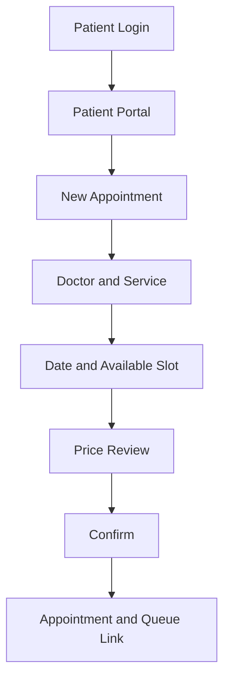

# نظام إدارة العيادة — دليل المشروع والتشغيل

> **آخر تحديث:** 2026-08-14
> **نوع النظام:** Clinic Management System لعيادة نساء وتوليد متعددة الأطباء
> **اللغة:** واجهة RTL عربية مع مصطلحات تشغيلية English عند الحاجة

هذا الملف هو الدليل التشغيلي والتقني الموحد للمشروع. يشرح النظام كما هو مبني في الكود، ومن يخدم، وما الذي يستطيع كل مستخدم فعله، وكيف تتحرك البيانات من الحجز إلى الطابور ثم الزيارة الطبية، بالإضافة إلى طريقة التشغيل والنشر والاختبار.

## 1. ملخص تنفيذي

النظام يفصل بين أربع رحلات مرتبطة:

1. **تشغيل العيادة:** الأطباء، الخدمات، الأسعار، الجداول، الحجوزات والطابور.
2. **ملف المريضة:** سجل تشغيلي موحد، تعيينات، حالات وملخص سريع.
3. **السجل الطبي:** الزيارات، التاريخ النسائي والولادي، الحمل، الأدوية، الحساسية، التحاليل، السونار، المستندات والتطور.
4. **تجربة المريضة:** إنشاء حساب بالبريد الإلكتروني وكلمة المرور **بدون OTP**، تسجيل الدخول، رؤية مواعيدها ومتابعة رابط الدور العام.

المبدأ الأهم هو أن <code>Appointment</code> يمثل ما تم حجزه، بينما <code>Visit</code> يمثل ما حدث طبيًا بالفعل. كما أن <code>Pregnancy</code> حالة مستقلة مرتبطة بالمريضة ولا تختلط بتاريخ الحمل السابق.

## 2. من يخدم النظام؟

| المستخدم | الهدف اليومي | ما يراه ويستطيع فعله | ما لا يراه |
|---|---|---|---|
| **Clinic Owner** | إدارة وتشغيل العيادة بالكامل | كل المرضى، الأطباء، الخدمات، الأسعار، الجداول، الحجوزات، الطابور، السجل الطبي، التقارير، المستخدمون، الإعدادات وسجل التدقيق | لا توجد قيود تشغيلية داخل النطاق الحالي |
| **Doctor** | اتخاذ القرار الطبي وتوثيق الزيارة | المرضى والحالات المعيّنة له، الزيارات، الحمل، الأدوية، الحساسية، التحاليل، السونار، المستندات، التطور والتقارير المسموحة | مرضى غير معيّنين له، وإدارة المستخدمين والإعدادات التشغيلية |
| **Reception** | إدارة الاستقبال والحجز والطابور | البحث وإنشاء مريضة، الحجز، إعادة الجدولة، الإلغاء، Walk-in، Check-in، ترتيب الطابور، No Show، Pause/Resume، الخدمات والأسعار | Diagnosis، Clinical Notes، تفاصيل الحمل، الأدوية، الحساسية التفصيلية، التقارير الطبية |
| **Patient** | متابعة تعاملها مع العيادة والحجز الذاتي | إنشاء الحساب بدون OTP، تسجيل الدخول، رؤية Patient ID والبيانات التشغيلية، حجز موعد لنفسها من شاشة الحجز المشتركة، رؤية مواعيدها، فتح متابعة الدور | كل البيانات الطبية، Dashboard العيادة، مرضى آخرون، Queue Management، المستخدمون، التقارير الطبية، والحجز باسم مريضة أخرى |

### مصفوفة الصلاحيات الأساسية

~~~mermaid
flowchart LR
  Owner[Clinic Owner] --> All[كل الوحدات وكل السجلات]
  Doctor[Doctor] --> Assigned[المرضى والحالات المعيّنة]
  Doctor --> Medical[السجل الطبي والتقارير الطبية]
  Reception[Reception] --> Operations[الحجز والاستقبال والطابور]
  Reception -. ممنوع .-> Clinical[البيانات الطبية الحساسة]
  Patient[Patient] --> Portal[الحساب والمواعيد ومتابعة الدور]
  Patient -. ممنوع .-> Clinical
~~~

التحقق يتم في الـBackend بواسطة middleware وصلاحيات الدور؛ إخفاء رابط من الـSidebar ليس طبقة الحماية الوحيدة.

## 3. طريقة تسجيل المريضة — بدون OTP

### الرابط

من شاشة تسجيل الدخول تضغط المريضة:

~~~text
إنشاء حساب مريضة جديد
~~~

أو تفتح:

~~~text
/patient-register.html
~~~

### الحقول المستخدمة

| الحقل | الحالة | الاستخدام |
|---|---|---|
| الاسم الكامل | Required | الاسم الظاهر في الحجوزات والملف التشغيلي |
| تاريخ الميلاد | Optional | كشف التكرار وحساب العمر لاحقًا |
| الهاتف | Required | التواصل والبحث وكشف التكرار؛ لا يعني أنه تم التحقق منه |
| البريد الإلكتروني | Required | اسم الدخول الفريد |
| كلمة المرور | Required، 8 أحرف على الأقل | يتم تخزينها Hash باستخدام bcrypt |
| تأكيد كلمة المرور | Required | منع خطأ الإدخال |
| وسيلة التواصل المفضلة | Optional | <code>SMS</code> أو <code>WhatsApp</code> أو <code>Phone</code> |
| هاتف بديل | Optional | قناة تواصل احتياطية |
| العنوان | Optional | بيانات تشغيلية، وليس تاريخًا طبيًا |
| جهة اتصال للطوارئ وهاتفها | Optional | تستخدم عند الحاجة التشغيلية |
| الموافقة على إنشاء الحساب | Required | موافقة على استخدام بيانات التواصل للحجز والتنبيهات |

لا يوجد حقل OTP ولا إرسال رمز في هذا الـFlow. البريد والهاتف لا يتم اعتبارهما موثّقين تلقائيًا؛ لذلك يجب على العيادة اعتماد سياسة تواصل مناسبة قبل استخدامهما للرسائل الحساسة.

### ما يحدث خلف الكواليس

~~~mermaid
sequenceDiagram
  actor Patient as المريضة
  participant UI as patient-register.html
  participant API as POST /api/patient-portal/register
  participant Service as Patient Portal Service
  participant DB as SQL Server

  Patient->>UI: إدخال البيانات والموافقة
  UI->>API: JSON بدون OTP
  API->>API: Zod validation + rate limit
  API->>Service: normalize + bcrypt hash
  Service->>DB: Transaction تبدأ
  DB->>DB: فحص البريد والهاتف والاسم + تاريخ الميلاد
  alt يوجد حساب أو سجل مطابق
    DB-->>API: 409 EMAIL_EXISTS أو PATIENT_EXISTS
    API-->>UI: رسالة توجيه للتواصل مع العيادة
  else البيانات جديدة
    DB->>DB: INSERT Patients
    DB->>DB: INSERT Users(Role=patient, PatientId=...)
    DB->>DB: Commit + Audit Log
    DB-->>API: PatientCode + email
    API-->>UI: 201 Created
  end
~~~

### منع التكرار

يتم رفض التسجيل إذا تحقق أحد الآتي:

- البريد الإلكتروني موجود في <code>Users</code>.
- رقم الهاتف بعد إزالة الرموز والمسافات موجود في <code>Patients.NormalizedPhone</code>.
- الاسم بعد التطبيع + تاريخ الميلاد يطابقان سجلًا موجودًا.

لا يتم دمج الحساب تلقائيًا مع سجل قديم لأن التسجيل بدون OTP لا يثبت ملكية رقم الهاتف. عند ظهور تعارض، يراجع موظف العيادة السجل ثم يربط الحساب يدويًا إن كان ذلك صحيحًا.

### بعد نجاح التسجيل

1. يظهر للمريضة <code>Patient ID</code>.
2. تستخدم البريد وكلمة المرور في شاشة الدخول الرئيسية <code>/</code>.
3. يقرأ النظام <code>PatientId</code> من المستخدم ويرسلها تلقائيًا إلى <code>/patient-portal</code>.
4. تظهر المواعيد التشغيلية فقط.
5. عند وجود Queue Token يمكن فتح متابعة الدور العام.

لا يتم فتح السجل الطبي للمريضة في الإصدار الحالي.

## 4. الاستخدام حسب الدور

### 4.1 Owner — إعداد العيادة

الاستخدام الموصى به لأول مرة:

1. تسجيل الدخول بحساب المالك.
2. فتح **Doctors** وإضافة الأطباء وتفعيل حالتهم.
3. فتح **Services** وإضافة الخدمات ومدة الخدمة وهل تحتاج حجزًا أو طابورًا.
4. فتح **Pricing** وإضافة السعر حسب <code>Doctor + Service</code> وتاريخ السريان.
5. فتح **Schedules** وإضافة أيام وساعات العمل والاستثناءات.
6. فتح **Users & Roles** لإنشاء حسابات الـReception أو الأطباء وربط الطبيب بحسابه.
7. مراجعة **Settings** و**Audit Logs**.

### 4.2 Reception — بداية اليوم

~~~mermaid
flowchart TD
  A[تسجيل الدخول] --> B[Dashboard اليوم]
  B --> C{المريضة موجودة؟}
  C -- لا --> D[Add Patient]
  C -- نعم --> E[فتح السجل التشغيلي]
  D --> F[كشف التكرار ثم الحفظ]
  E --> G{لديها موعد؟}
  F --> H[New Booking أو Walk-in]
  G -- نعم --> I[Check-in]
  G -- لا --> H
  H --> J[إضافة للطابور]
  I --> K[Queue Management]
  J --> K
  K --> L[تغيير الحالة أو ترتيب الدور]
  L --> M[Start / Complete / No Show]
~~~

### 4.3 Reception — إنشاء حجز

الـFlow الموحد للحجز الهاتفي أو من داخل العيادة:

1. البحث بالاسم أو الهاتف أو Patient ID.
2. اختيار المريضة أو إنشاء Quick Patient عند الحاجة.
3. اختيار الطبيب.
4. اختيار الخدمة.
5. اختيار اليوم والـslot المتاح.
6. عرض السعر الفعلي حسب الطبيب والخدمة.
7. تأكيد الحجز.
8. يولد النظام Queue Entry عند احتياج الخدمة للطابور وPublic Tracking Token لمتابعة الدور.

الحجز الهاتفي ليس نظامًا آخر؛ هو نفس شاشة **New Booking** مع <code>BookingSource=phone</code>.

### 4.4 Walk-in

1. البحث أو إنشاء المريضة.
2. اختيار الطبيب والخدمة.
3. عرض Estimated Wait Range.
4. التأكيد.
5. إنشاء الحجز/الطابور حسب إعداد الخدمة.

### 4.5 Doctor — أثناء الزيارة

1. فتح **Queue** أو **Visits**.
2. اختيار مريضة معيّنة للطبيب.
3. مراجعة الملخص السابق والتنبيهات والحالة النشطة.
4. بدء الزيارة.
5. إدخال البيانات المنظمة المناسبة لنوع الزيارة فقط.
6. إضافة Diagnosis/Assessment/Plan داخل صلاحية الطبيب.
7. حفظ Draft عند الحاجة.
8. Complete Visit لتثبيت الزيارة واحتساب مدة الكشف.
9. إضافة Follow-up أو دواء أو تحليل أو سونار عند الحاجة.

### 4.6 Patient — بعد إنشاء الحساب

1. تسجيل الدخول من <code>/</code>.
2. الانتقال تلقائيًا إلى **مواعيدي ومتابعة الدور**.
3. الضغط على **Book a new appointment**.
4. اختيار الطبيب والخدمة والتاريخ والـslot المتاح.
5. مراجعة السعر ثم تأكيد الحجز.
6. مراجعة رقم الموعد ورابط متابعة الدور من الـPortal.

### 4.7 Patient Self-booking — نفس شاشة الحجز

المريضة تستخدم نفس Route <code>/appointments/new</code> ونفس Endpoint <code>POST /api/appointments</code> المستخدمين بواسطة الـReception. الواجهة تخفي اختيار مريضة أخرى وملاحظات التشغيل، وتثبت الحساب الحالي تلقائيًا. الـBackend يفرض <code>patientId</code> من الـJWT، ويسجل <code>BookingSource=online</code>، ويطبق نفس فحص الـAvailability والـDouble Booking والسعر والمعاملة.

## 5. الشاشات والـRoutes

### الشاشات الداخلية

| Route | الشاشة | المستخدمون |
|---|---|---|
| <code>/dashboard</code> | Dashboard اليوم | Owner / Doctor / Reception |
| <code>/patients</code> | كل المرضى والبحث | Owner / Doctor / Reception حسب التعيين |
| <code>/patients/new</code> | إضافة مريضة | Owner / Reception |
| <code>/patients/:id</code> | ملف المريضة | Owner / Doctor / Reception ببيانات منقحة |
| <code>/assignments</code> | ربط المريضة بالطبيب والحالة بالطبيب | Owner / Reception بصلاحية الإدارة |
| <code>/appointments</code> | التقويم والحجوزات | Owner / Doctor / Reception |
| <code>/appointments/new</code> | New Booking / Phone / Walk-in / Patient Self-booking | Owner / Reception / Patient لحسابها فقط |
| <code>/queue</code> | إدارة الطابور والتوقف | Owner / Reception |
| <code>/doctors</code> | الأطباء وخدماتهم | Owner |
| <code>/schedules</code> | جداول الأطباء والاستثناءات | Owner / Doctor حسب الصلاحية |
| <code>/services</code> | الخدمات ومددها | Owner / Doctor / Reception للعرض |
| <code>/pricing</code> | الأسعار حسب الطبيب والخدمة | Owner / Doctor / Reception للعرض |
| <code>/visits</code> | الزيارات الطبية | Owner / Doctor |
| <code>/cases</code> | الحالات الطبية | Owner / Doctor |
| <code>/history</code> | التاريخ النسائي والولادي | Owner / Doctor |
| <code>/pregnancy</code> | الحمل ومتابعته | Owner / Doctor |
| <code>/medications</code> | الأدوية والتاريخ الدوائي | Owner / Doctor |
| <code>/allergies</code> | الحساسية والموانع | Owner / Doctor |
| <code>/labs</code> | التحاليل والنتائج | Owner / Doctor |
| <code>/ultrasound</code> | السونار والتقارير | Owner / Doctor |
| <code>/documents</code> | المستندات والمرفقات | Owner / Doctor |
| <code>/progress</code> | مؤشرات التطور والمقارنة | Owner / Doctor |
| <code>/reports</code> | التقارير الطبية | Owner / Doctor |
| <code>/notifications</code> | سجل التنبيهات | المستخدمون المسموح لهم |
| <code>/users</code> | المستخدمون والأدوار | Owner |
| <code>/settings</code> | إعدادات العيادة | Owner |
| <code>/patient-portal</code> | مواعيد المريضة ومتابعة الدور | Patient فقط |

### الشاشات العامة

| Route | الغرض |
|---|---|
| <code>/</code> | تسجيل دخول المستخدمين الداخليين والمريضات |
| <code>/patient-register.html</code> | إنشاء حساب مريضة بالبريد وكلمة المرور بدون OTP |
| <code>/queue-tracking.html?token=...</code> | متابعة دور آمنة بدون كشف بيانات طبية |

## 6. الحجز والطابور والوقت المتوقع

### حالات الحجز والطابور

~~~text
Booked → Confirmed → Arrived → Waiting → InConsultation → Completed
                       ├──────────────→ Late
                       ├──────────────→ NoShow
                       ├──────────────→ Cancelled
                       └──────────────→ Skipped
~~~

~~~mermaid
stateDiagram-v2
  [*] --> Booked
  Booked --> Confirmed
  Confirmed --> Arrived: Check-in
  Arrived --> Waiting
  Waiting --> InConsultation: Start
  Late --> InConsultation: Start
  InConsultation --> Completed: Complete
  Booked --> Cancelled
  Confirmed --> Cancelled
  Arrived --> NoShow
  Waiting --> Skipped
  Late --> NoShow
~~~

### حساب مدة الكشف

~~~text
Expected Duration
  = Service Base Duration
  + Doctor Historical Adjustment
  + Current Day Adjustment
~~~

بعد إنهاء الزيارة:

1. يحفظ النظام <code>ActualDurationMinutes</code>.
2. يعيد تحديث الإحصائيات المستخدمة للطبيب والخدمة.
3. يعيد حساب <code>ExpectedStartAt</code> و<code>ExpectedEndAt</code> للطابور المتأثر.
4. تعرض الواجهة Range تقريبيًا بدل وعد بوقت دقيق.

### Pause / Resume

~~~mermaid
sequenceDiagram
  participant R as Reception
  participant API as Queue API
  participant DB as SQL Server
  participant RT as Socket.IO / fallback
  participant P as Patient tracking page

  R->>API: POST /api/queue/pauses
  API->>DB: حفظ Pause
  API->>DB: Recalculate affected queue
  API->>RT: doctor:paused + queue:recalculated
  RT-->>P: نطاق انتظار جديد
  R->>API: POST /api/queue/pauses/:id/resume
  API->>DB: حفظ وقت العودة وإعادة الحساب
  API->>RT: doctor:resumed
~~~

في حالة عودة الطبيب مبكرًا، يتم استخدام **Resume Queue** لتقليل التأخير وإرسال تحديث جديد بدل الاحتفاظ بحساب التوقف القديم.

## 7. ملف المريضة والسجل الطبي

### ملخص الملف

عند فتح الملف لا يتم تحميل كل التاريخ في Request واحدة. يبدأ النظام ببيانات الملخص، ثم تحمل الـTabs عند الحاجة:

~~~text
Basic Data
Current Case
Current Medications
Important Allergies
Latest Visit
Current Pregnancy Summary
Next Follow-up
Alerts
~~~

الـTimeline يستخدم pagination/Load More بدل تحميل آلاف الأحداث مرة واحدة.

### العلاقات الأساسية

~~~mermaid
erDiagram
  PATIENTS ||--o{ USERS : owns_login
  PATIENTS ||--o{ APPOINTMENTS : books
  PATIENTS ||--o{ MEDICAL_CASES : has
  PATIENTS ||--o{ VISITS : attends
  PATIENTS ||--o{ PREGNANCIES : has
  PATIENTS ||--o{ MEDICATIONS : receives
  PATIENTS ||--o{ ALLERGIES : reports
  PATIENTS ||--o{ LAB_TESTS : has
  PATIENTS ||--o{ ULTRASOUNDS : has
  PATIENTS ||--o{ DOCUMENTS : owns
  DOCTORS ||--o{ APPOINTMENTS : serves
  DOCTORS ||--o{ VISITS : writes
  DOCTORS ||--o{ PATIENT_ASSIGNMENTS : receives
  APPOINTMENTS ||--o| QUEUE_ENTRIES : creates
  APPOINTMENTS ||--o{ VISITS : may_result_in
  MEDICAL_CASES ||--o{ VISITS : groups
  PREGNANCIES ||--o{ PREGNANCY_VISITS : tracks
~~~

### النماذج الطبية الواقعية

لم يتم اختيار الحقول الطبية لمجرد ملء الشاشة. سجل التصميم موجود في:

~~~text
docs/medical-forms/
~~~

ويشمل:

- <code>patient-history.md</code>: بيانات المريضة والتاريخ النسائي.
- <code>gynecology-visit.md</code>: زيارة نساء حسب سبب الزيارة والأعراض والفحص الذي تم فعليًا.
- <code>pregnancy-record.md</code>: سجل حمل مستقل، LMP/EDD، Gravida/Para، عوامل الخطورة ونتيجة الولادة.
- <code>antenatal-visit.md</code>: متابعة الحمل، ضغط الدم، الوزن، proteinuria، الوذمة، نبض الجنين وقياسات الحمل الشرطية.
- <code>ultrasound-record.md</code>: حقول مختلفة للسونار التوليدي وسونار الحوض بدل Form عام واحد.
- <code>medication-record.md</code>: الجرعة، الوحدة، الطريق، التكرار، المدة، السبب، الحالة وتاريخ الإيقاف.
- <code>allergy-lab-records.md</code>: حساسية Structured ونتائج تحاليل قابلة للمقارنة والرسم.

الحقول تصنف إلى <code>Required</code>، <code>Optional</code>، <code>Conditional</code>، <code>Auto-calculated</code>، <code>Read-only</code>. القيم التي تحتاج بحثًا أو Trend تخزن Structured، أما السرد الطبي فيبقى Free Text للطبيب. النظام لا يصدر Automatic Diagnosis ولا يستبدل مراجعة الطبيب.

## 8. الوحدات الطبية بالتفصيل

| الوحدة | الوظيفة |
|---|---|
| Visits | فصل الزيارة الفعلية عن الحجز، حفظ Draft ثم Complete |
| Cases | أكثر من حالة للمريضة، مع طبيب وحالة وتواريخ مستقلة |
| Pregnancy | كل حمل Case مستقلة، متابعة عمر الحمل والقياسات والنتائج |
| Medications | سجل دوائي تاريخي؛ الإيقاف يغير الحالة ولا يحذف السطر |
| Allergies | Substance، Reaction، Severity، Status، Notes مع Alert واضح |
| Labs | نتيجة رقمية أو نصية، Unit، Reference Range، Abnormal Flag، Status |
| Ultrasound | نوع الفحص وقياسات مناسبة له وFindings/Impression ومرفقات |
| Documents | PDF وصور وتقارير مرتبطة بالمريضة/الحالة/الزيارة كـmetadata |
| Progress | Previous/Current/Difference/Trend مع Doctor Validation، وليس تشخيصًا آليًا |
| Reports | Patient Summary وProgress وPregnancy وMedication وLab Trends حسب الصلاحية |

## 9. البنية التقنية

### Stack الإلزامي

~~~text
Frontend: HTML5 + CSS3 + Vanilla JavaScript + Tailwind CSS + Custom CSS + RTL
Backend: Node.js + Express.js
Database: Microsoft SQL Server + mssql
API: REST + JSON + fetch
Realtime: Socket.IO محليًا/على بيئة طويلة التشغيل، مع fallback للويب العام
Alerts: SweetAlert2
Reports: Browser Print وhtml2pdf.js عند الحاجة
Environment: dotenv + .env
Hosting: Vercel حاليًا، قابل للنقل إلى VPS/Docker
~~~

### تدفق الطلب داخل الـBackend

~~~mermaid
flowchart LR
  Browser[Vanilla JS + fetch] --> Route[Express Route]
  Route --> Controller[Controller: HTTP فقط]
  Controller --> Service[Service: Business Logic]
  Service --> Repository[Repository: SQL فقط]
  Repository --> SQL[(Microsoft SQL Server)]
  Service --> Audit[Audit Log]
  Service --> Realtime[Socket.IO Events]
  Service --> Notify[Notification Service]
~~~

<code>server.js</code> مسؤول عن إنشاء الخادم وتصدير Express فقط. منطق الأعمال موزع داخل <code>src/modules</code> وليس داخل ملف تشغيل كبير.

### Frontend Feature-Based

~~~text
public/
  index.html
  patient-register.html
  queue-tracking.html
  css/
  js/
    core/                 # auth, api-service, router, ui
    pages/                # شاشة مستقلة لكل Module
    patient-register.js   # التسجيل العام بدون OTP
  assets/

src/
  app.js
  config/
  db/
  middleware/
  routes/
  services/
  modules/
    patients/
    doctors/
    appointments/
    queue/
    medical-records/
    pregnancy/
    medications/
    allergies/
    labs/
    ultrasound/
    documents/
    pricing/
    reports/
    notifications/
    users/
    patient-portal/
  realtime/
  jobs/
  utils/
~~~

## 10. API Groups

كل الاستجابات JSON بالشكل العام:

~~~json
{
  "success": true,
  "data": {},
  "meta": {}
}
~~~

وعند الخطأ:

~~~json
{
  "success": false,
  "error": {
    "code": "VALIDATION_ERROR",
    "message": "رسالة مفهومة للمستخدم"
  }
}
~~~

### Authentication وPatient Portal

| Method | Endpoint | Auth | الغرض |
|---|---|---|---|
| <code>POST</code> | <code>/api/auth/login</code> | Public | دخول Owner/Doctor/Reception/Patient |
| <code>GET</code> | <code>/api/auth/me</code> | Session/JWT | استعادة المستخدم الحالي |
| <code>POST</code> | <code>/api/auth/logout</code> | Optional | إنهاء الجلسة |
| <code>POST</code> | <code>/api/patient-portal/register</code> | Public + rate limit | إنشاء Patient + User في Transaction، بدون OTP |
| <code>GET</code> | <code>/api/patient-portal/summary</code> | Patient فقط | بيانات المريضة التشغيلية ومواعيدها |
| <code>POST</code> | <code>/api/appointments</code> | Owner / Reception / Patient لحسابها فقط | إنشاء حجز من شاشة الحجز المشتركة |
| <code>GET</code> | <code>/api/public/queue/:token</code> | Public token | حالة الدور، عدد من أمامها، والوقت المتوقع |

### مجموعات الـAPI الأخرى

~~~text
/api/dashboard
/api/patients
/api/doctors
/api/appointments
/api/queue
/api/services
/api/pricing
/api/schedules
/api/visits
/api/cases
/api/pregnancies
/api/medications
/api/allergies
/api/labs
/api/ultrasounds
/api/documents
/api/progress
/api/reports
/api/notifications
/api/users
/api/settings
/api/audit
/api/medical-history
~~~

## 11. قاعدة البيانات

### الجداول الرئيسية

~~~text
Doctors, Users, Patients, Services, Pricing
DoctorSchedules, ScheduleExceptions, DoctorServices
Appointments, QueueEntries, DoctorPauses
MedicalCases, PatientAssignments, Visits
Pregnancies, PregnancyVisits, ObstetricHistory, PatientGyneHistories
Medications, Allergies, LabTests, Ultrasounds, Documents
ProgressIndicators, Notifications, Settings, AuditLogs
~~~

### ربط حساب المريضة

~~~text
Users.PatientId -> Patients.Id
Users.Role = 'patient'
UX_Users_PatientId (filtered unique index)
~~~

وبذلك لا يستطيع حسابان نشطان أن يرتبطا بنفس سجل المريضة عبر المسار الإداري العادي.

### الأداء والفهارس

تم إنشاء فهارس للبحث والعمليات المتكررة، أهمها:

- <code>Patients.NormalizedPhone</code> و<code>Patients.NormalizedName</code>.
- <code>Appointments(DoctorId, StartAt, Status)</code> للطابور والـslots.
- <code>Appointments(PatientId, StartAt, Status)</code> لمواعيد المريضة.
- <code>QueueEntries(DoctorId, QueueDate, Position, Status)</code> لإعادة الحساب.
- <code>Visits</code>، <code>Medications</code>، <code>LabTests</code>، <code>Ultrasounds</code> حسب المريضة والتاريخ.
- <code>AuditLogs(Entity, EntityId, CreatedAt)</code> للتدقيق.

لا يتم تحميل كل السجلات للمتصفح؛ القوائم تستخدم pagination وfilter وserver-side search عند توفرها.

### Transactions وConcurrency

العمليات الحساسة التي تجمع أكثر من كتابة تستخدم Transaction. مثال التسجيل:

~~~text
Check duplicate
→ Insert Patient
→ Insert User linked to Patient
→ Commit
~~~

الحجز يستخدم أقفال SQL والتحقق من overlap لمنع Double Booking عند محاولة موظفين حجز آخر slot في الوقت نفسه.

## 12. الأمان والخصوصية

- Authentication بواسطة session cookie تحتوي JWT؛ <code>httpOnly</code> و<code>sameSite</code>، و<code>secure</code> في الإنتاج.
- Role-based Authorization على مستوى الـBackend.
- Password Hashing باستخدام bcryptjs.
- Zod validation في الـBackend حتى لو تم تجاوز واجهة المتصفح.
- Parameterized SQL queries عبر <code>mssql</code> لمنع SQL Injection.
- Helmet وCORS وCompression وRate Limiting.
- Rate limit مستقل لتسجيل المريضة؛ لا يوجد OTP في الـFlow الحالي.
- Audit Logs للعمليات الحساسة، مثل التسجيل، التعيين، تعديل الزيارة، الدواء وتغييرات الطابور.
- أزرار الحذف في الأطباء والخدمات والأسعار والجداول والمستخدمين والمرضى تنفذ حذفًا فعليًا مع Confirmation وAudit Log؛ يمنع الـBackend الحذف إذا كانت هناك علاقات لازمة أو حجوزات مرتبطة.
- السجل الطبي والزيارات والأدوية والنتائج والمستندات لا يتم Hard Delete لها؛ تظل محمية بالتاريخ والإصدارات وStatus/Addendum حتى لا تضيع المعلومة السريرية.
- Reception لا يحصل على Clinical Notes أو Diagnosis أو تفاصيل الحمل؛ التحقق يتم من السيرفر.
- لا تسجل كلمات المرور أو Tokens أو نصوص الملاحظات الطبية الكاملة داخل Logs.
- الملفات تقيد بالحجم ونوع MIME واسم تخزين مولد؛ SQL Server يحتفظ بالـmetadata لا Base64.

### تنبيه مهم عن التسجيل بدون OTP

عدم استخدام OTP يعني أن البريد والهاتف وسيلتا تعريف وليستا إثبات ملكية. لا يجب إرسال نتائج طبية أو مستندات حساسة اعتمادًا على التسجيل وحده. رابط متابعة الدور العام مصمم ليعرض حالة تشغيلية محدودة فقط.

## 13. الملفات والتخزين

أنواع الملفات المدعومة حاليًا: PDF، JPEG، PNG، WebP ضمن حد الحجم الموجود في Environment.

~~~text
Documents
  PatientId
  CaseId
  VisitId
  DocumentType
  FileName
  MimeType
  FileSizeBytes
  StoragePath
  DocumentDate
  UploadedBy
~~~

في Vercel، مساحة <code>/tmp</code> مؤقتة وليست تخزينًا دائمًا. قبل تفعيل رفع ملفات إنتاجي يجب ربط Object Storage دائم (مثل S3-compatible provider) وتخزين <code>StoragePath</code> فقط في SQL Server.

## 14. Real-time والإشعارات

أحداث الطابور الأساسية:

~~~text
queue:updated
queue:recalculated
doctor:paused
doctor:resumed
appointment:updated
~~~

بيئة Node طويلة التشغيل يمكنها استخدام Socket.IO مباشرة. في Serverless لا ينبغي افتراض اتصال WebSocket دائم داخل Function؛ لذلك يوجد fallback للتحقق الدوري من رابط متابعة الدور.

Notification Service يفصل القناة عن الحدث، ويجهز مستقبلًا لـ:

~~~text
NotificationService
  ├── WhatsAppLinkProvider (wa.me / whatsapp://)
  ├── WhatsAppApiProvider (future)
  └── SmsProvider (future)
~~~

لا ينبغي إرسال إشعار لكل تعديل صغير؛ التغيير المؤثر في Estimated Time هو الذي يستحق التنبيه، مع إمكانية تطبيق threshold مثل 10–15 دقيقة.

## 15. التشغيل المحلي

### المتطلبات

- Node.js 20 أو أحدث.
- SQL Server متاح من الجهاز.
- صلاحية إنشاء الجداول والفهارس في قاعدة البيانات.

### الخطوات

~~~powershell
npm install
Copy-Item .env.example .env
# عدّل .env وضع بيانات قاعدة البيانات والأسرار خارج Git
npm run db:migrate
npm run db:seed
npm run build:css
npm start
~~~

ثم افتح:

~~~text
http://localhost:3000
~~~

### أوامر التحقق

~~~powershell
npm test
npm run check
npm run build:css
~~~

الـmigration idempotent ويمكن تشغيله أكثر من مرة دون إعادة إنشاء الجداول الموجودة.

### Environment Variables

استخدم الأسماء الموجودة في <code>.env.example</code> دون وضع القيم السرية داخل المستودع:

~~~text
NODE_ENV
PORT
APP_ORIGIN
CLINIC_TIME_ZONE
JWT_SECRET
JWT_EXPIRES_IN
COOKIE_SECURE
DB_SERVER
DB_DATABASE
DB_USER
DB_PASSWORD
DB_ENCRYPT
DB_TRUST_SERVER_CERTIFICATE
DB_MULTIPLE_ACTIVE_RESULT_SETS
DB_POOL_MAX
DB_POOL_MIN
DB_POOL_IDLE_TIMEOUT
UPLOAD_DIR
MAX_UPLOAD_BYTES
LOG_LEVEL
SEED_OWNER_EMAIL
SEED_OWNER_PASSWORD
SEED_DOCTOR_PASSWORD
SEED_RECEPTION_PASSWORD
~~~

## 16. النشر على Vercel

ملف <code>vercel.json</code> يقسم النشر إلى:

1. Static assets من <code>public/</code>.
2. Serverless Node Function من <code>server.js</code>.
3. Routes صريحة للـHTML و<code>/css/*</code> و<code>/js/*</code>.

~~~mermaid
flowchart TD
  User[المستخدم] --> Vercel[Vercel]
  Vercel --> Static[public HTML/CSS/ESM JS]
  Vercel --> Function[server.js / Express Function]
  Function --> SQL[(Remote SQL Server)]
  Function --> Storage[Object Storage مستقبلًا]
  Function --> Logs[Structured Logs]
~~~

قبل أي نشر:

1. تأكد أن Environment Variables موجودة في Project Environment الصحيحة.
2. شغل migration على قاعدة البيانات المطلوبة.
3. شغل <code>npm test</code> و<code>npm run check</code> و<code>npm run build:css</code>.
4. اختبر <code>/api/health</code>.
5. اختبر <code>/patient-register.html</code> وملفات ESM.
6. اختبر تسجيل بيانات غير صحيحة للتأكد من <code>400</code>، وبريد موجود للتأكد من <code>409</code>.
7. اختبر تسجيل الدخول والـPatient Portal دون كشف بيانات طبية.

لا تستخدم <code>cdn.tailwindcss.com</code> في الإنتاج؛ CSS الإنتاج مبني محليًا عبر Tailwind CLI. ملفات المتصفح تستخدم ES Modules، لذلك لا يوضع فيها <code>require()</code>.

## 17. اختبار التسجيل بدون OTP

### بيانات صحيحة نموذجية

~~~json
{
  "fullName": "Sara Ahmed",
  "dateOfBirth": "1992-04-12",
  "phone": "01012345678",
  "email": "sara@example.com",
  "password": "ChangeMe!123",
  "confirmPassword": "ChangeMe!123",
  "preferredContactChannel": "whatsapp",
  "consent": true
}
~~~

### طلب API

~~~http
POST /api/patient-portal/register
Content-Type: application/json
~~~

النتيجة الناجحة <code>201</code> وتحتوي على <code>patientId</code> و<code>patientCode</code> و<code>email</code>.

### حالات الاختبار المتوقعة

| الحالة | HTTP | Code |
|---|---:|---|
| بريد غير صحيح أو كلمة مرور قصيرة أو موافقة ناقصة | 400 | <code>VALIDATION_ERROR</code> |
| البريد مستخدم | 409 | <code>EMAIL_EXISTS</code> |
| الهاتف أو الاسم + تاريخ الميلاد يطابق سجلًا | 409 | <code>PATIENT_EXISTS</code> |
| حساب مريضة غير مربوط بسجل | 403 | <code>PATIENT_ACCOUNT_UNLINKED</code> |
| طلب Patient Portal بدون جلسة | 401 | <code>UNAUTHENTICATED</code> |

## 18. استكشاف الأخطاء الشائعة

### Vercel يرجع 500 FUNCTION_INVOCATION_FAILED

راجع بالترتيب:

1. Vercel Function Logs.
2. وجود كل متغيرات DB و<code>JWT_SECRET</code> وعدم وجود قيمة فارغة.
3. وصول Vercel إلى SQL Server ونجاح <code>mssql</code> connection.
4. تشغيل <code>npm run db:migrate</code> على نفس قاعدة البيانات.
5. تجربة <code>/api/health</code> ثم endpoint صغير قبل اختبار شاشة كاملة.

### require is not defined في المتصفح

هذا يعني أن ملف Browser تم تحميله كـCommonJS. الحل هو استخدام <code>import/export</code> و<code>&lt;script type="module"&gt;</code>، والتأكد أن Route الملفات الثابتة يعيد <code>/public/js/...</code> الصحيح.

### تحذير Tailwind CDN

لا تستخدم CDN في production. شغل:

~~~powershell
npm run build:css
~~~

ثم تأكد أن الصفحة تحمل <code>/css/tailwind.css</code> المحلي.

### المريضة ترى PATIENT_ACCOUNT_UNLINKED

الحساب الإداري القديم غير مرتبط بـ<code>Users.PatientId</code>. الحل:

1. افتح سجل المريضة الموجود.
2. اربط User بدور <code>patient</code> مع Patient ID الصحيح من شاشة المستخدمين.
3. أو استخدم التسجيل العام لإنشاء Patient وUser في Transaction واحدة.

### سجل طبي يظهر لموظف الاستقبال

لا تعتمد على الواجهة فقط. راجع role والصلاحية واطلب endpoint من السيرفر؛ يجب أن يرجع <code>403</code> عند عدم وجود <code>medical:view</code>، كما أن بيانات Patient Profile التشغيلية تكون منقحة.

## 19. حدود النسخة الحالية وخطة التوسع

### موجود ومفعل

- تشغيل عيادة متعدد الأطباء.
- المرضى والتعيينات والحجوزات والخدمات والأسعار والجداول.
- Queue مع reorder وPause/Resume ووقت متوقع متغير.
- فصل Appointment عن Visit.
- الوحدات الطبية الأساسية وسجل النماذج الطبية.
- حساب مريضة بدون OTP ومتابعة مواعيدها ودورها.
- صلاحيات Server-side وAudit Logs وSQL indexes.
- Vercel static/serverless routing وCSS إنتاج محلي.

### يحتاج ربطًا أو توسعًا قبل اعتماده كمنتج كامل

- Email verification أو OTP اختياري إذا قررت العيادة إثبات ملكية القناة مستقبلًا.
- Self-booking للمريضة، مع قواعد availability وcancellation واضحة.
- Provider فعلي لـSMS وWhatsApp Business API.
- Object Storage دائم للملفات على Vercel.
- Worker/Queue مستقل للـJobs الثقيلة والتنبيهات الكبيرة.
- PDF server-side للتقارير الكبيرة.
- WebSocket دائم عبر VPS أو مزود Realtime عند الحاجة إلى live updates كاملة.
- اختبارات E2E كاملة لمسار إنشاء مريضة → حجز → Check-in → Visit → Complete.

## 20. Definition of Done لكل Module

لا تعتبر الوحدة مكتملة إلا إذا توفرت:

- Route وAPI.
- Controller/Service/Repository منفصلة.
- Validation Frontend وBackend.
- Loading وEmpty وError states.
- Pagination وSearch عندما تكون البيانات كبيرة.
- صلاحيات Server-side.
- Audit Log للعملية الحساسة.
- Responsive behavior.
- Test للحالات الطبيعية وEdge Cases.
- توثيق Workflow والحقول الطبية عند ارتباط الوحدة بالرعاية.

## 21. خريطة الملفات المهمة

~~~text
server.js                         # تشغيل/تصدير Express فقط
src/app.js                        # middleware والتطبيق
src/routes/index.js               # تجميع API routers
src/db/connection.js              # SQL connection pool
src/db/repository.js              # query/transaction helpers
src/middleware/auth.js             # Authentication/roles
src/middleware/error-handler.js    # أخطاء مركزية
src/modules/patient-portal/        # تسجيل المريضة وملخص الحساب
src/modules/appointments/          # الحجز والـslots
src/modules/queue/                 # Queue/Pause/Resume/recalculation
src/modules/medical-records/       # validation/access للنماذج الطبية
database/schema.sql                # Schema + migrations + indexes
scripts/migrate.js                 # تشغيل batches SQL
scripts/seed.js                    # بيانات التشغيل التجريبية
public/js/core/                    # API/Auth/Router/UI
public/js/pages/                   # شاشات مستقلة Lazy-loaded
public/patient-register.html       # التسجيل العام بدون OTP
vercel.json                        # Static + Serverless routing
docs/medical-forms/                # مبررات الحقول الطبية ومراجعها
~~~

هذا الملف يصف الـworkflow التشغيلي، بينما تبقى ملفات <code>docs/medical-forms/</code> المرجع التفصيلي لاختيار الحقول الطبية قبل إضافة أي Form جديد.
