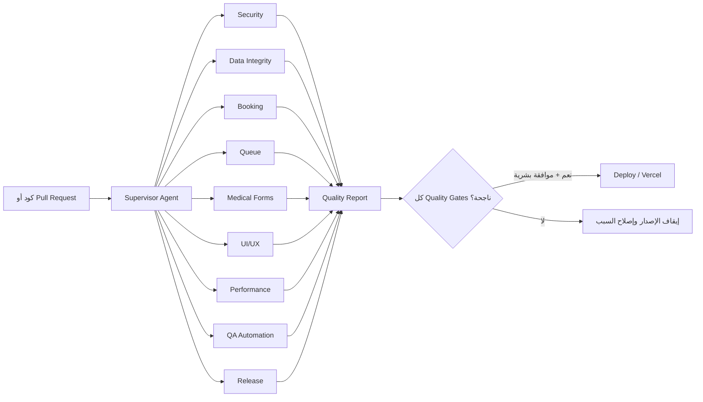
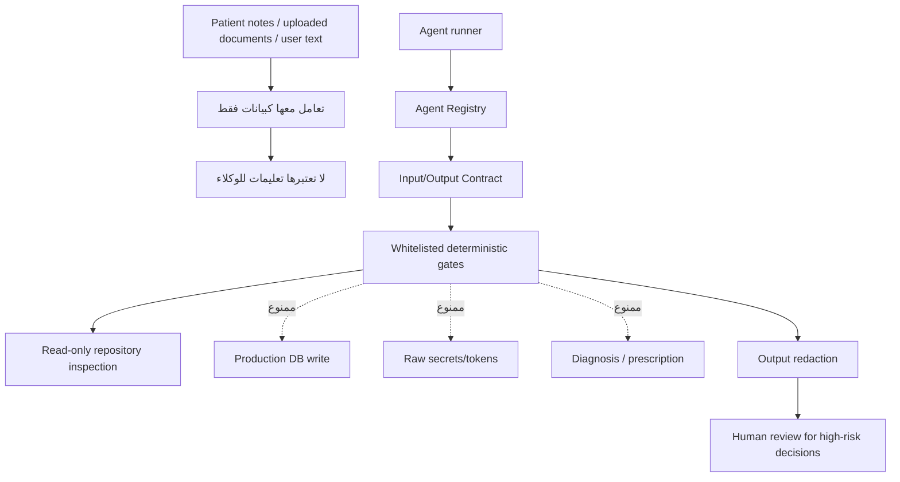
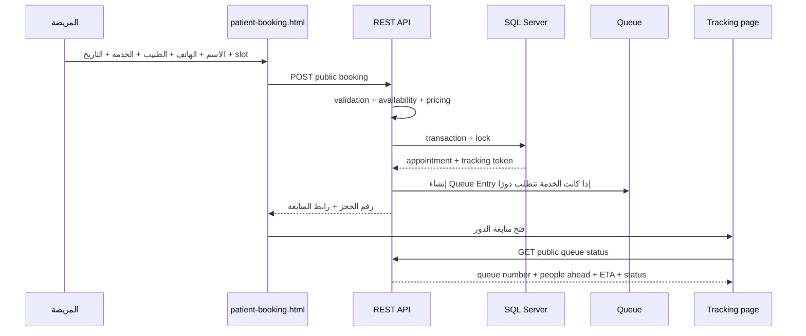
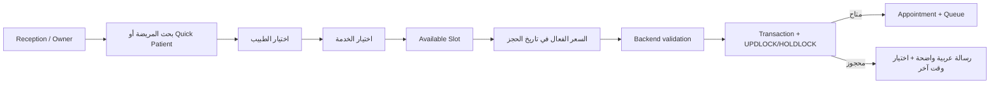
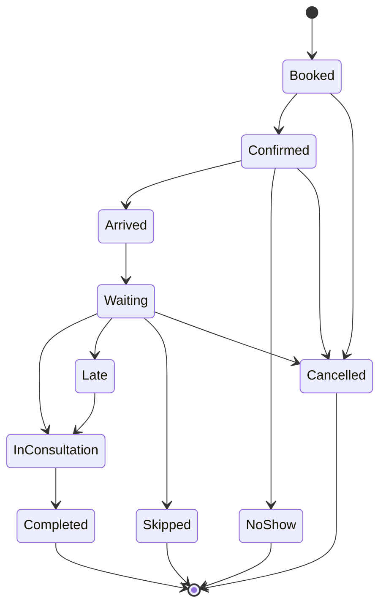
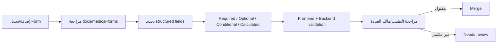

# Clinic QA Agent Control Plane

هذه الوثيقة تصف طبقة ضمان الجودة والحوكمة الخاصة بنظام العيادة. الطبقة تحتوي على عشرة وكلاء متخصصين، لكن تشغيلهم الحالي **حتمي وقابل لإعادة الإنتاج** من خلال فحوصات محلية معروفة. لم يتم ربط أي مزود LLM أو إعطاء أي وكيل وصولًا مباشرًا إلى SQL Server.

## لماذا نستخدم الوكلاء؟

النظام يجمع بين حجز عام بدون تسجيل دخول، حجز موظفي الاستقبال، أدوار لحظية، بيانات طبية حساسة، أكثر من طبيب، وبيانات تحتاج إلى سلامة عالية. لذلك لا يكفي اختبار الشاشة فقط. كل تغيير يجب أن يمر عبر مسارات متخصصة:



## الوكلاء العشرة

السجل الرسمي موجود في [`src/agents/agent-registry.js`](../../src/agents/agent-registry.js). كل وكيل `read-only`، ولا يملك أي وكيل صلاحية كتابة قاعدة البيانات.

| الوكيل | مسؤوليته الوحيدة | المدخلات | المخرجات | قرار بشري؟ |
|---|---|---|---|---|
| `supervisor` | التنسيق، التوجيه، اكتشاف التعارض، التقرير النهائي | نطاق التغيير، نتائج الفحوصات | حالة موحدة، blockers، التوصيات | نعم قبل الإصدار |
| `security` | Authentication/Authorization، الأسرار، الرفع، Rate Limit، Audit | diff، routes، permission matrix | مخاطر وصلاحيات وتوصيات | نعم للمخاطر العالية |
| `data_integrity` | Transactions، القيود، race conditions، العلاقات | schema، repositories، tests | سلامة الحجز والطابور والتاريخ | نعم للتغييرات الحساسة |
| `booking` | Public/Patient/Reception/Owner booking، slots، pricing، conflict | booking routes/services/tests | صلاحية مسار الحجز | لا، لكن blocker يمنع الإصدار |
| `queue` | رقم الدور، ahead count، ETA، pause/resume، realtime | queue service، socket، tracker | صحة تقدم الدور وfallback | لا |
| `medical_forms` | واقعية النماذج، structured fields، requiredness، حدود الطبيب | medical-form docs، validation | مراجعة الحقول وملاحظاتها | نعم؛ لا يوجد تشخيص آلي |
| `ui_ux` | RTL، التنقل، responsive، loading/error/empty، accessibility | routes، frontend، screenshots عند توفرها | مشاكل usability قابلة للتنفيذ | عند الأثر الكبير |
| `performance` | pagination، indexes، dedupe، timeout، lazy loading | SQL، API layer، frontend requests | مخاطر latency وscale | لا |
| `qa_automation` | Unit/integration/permission/regression/syntax | test selection، repository | نتائج قابلة لإعادة التشغيل | لا |
| `release` | Release preflight، env shape، migrations، health، rollback readiness | target، diff، health checks | checklist للإصدار | نعم دائمًا |

## حدود الثقة والصلاحيات



القواعد الإلزامية:

1. الوكيل لا يتصل بقاعدة البيانات مباشرة؛ يقرأ ملفات المشروع أو يشغل الفحوصات المسموح بها فقط.
2. لا يتم تمرير كلمات المرور أو Tokens أو Connection Strings إلى التقرير.
3. أي نص من المريضة أو ملف مرفوع يعتبر untrusted data ولا يمكنه تغيير تعليمات الوكيل.
4. ممنوع تجاوز الصلاحيات أو إخفاء فشل Permission Gate.
5. الوكيل الطبي يراجع بنية النموذج فقط؛ لا يشخص ولا يصف علاجًا ولا يستبدل الطبيب.
6. لا يوجد `DELETE` أو Migration أو Deploy تلقائي من الـSupervisor.
7. الإصدار يحتاج نجاح الفحوصات وموافقة بشرية منفصلة، حتى لو كان التقرير `pass`.

## حالات نتيجة الوكيل

| الحالة | معناها | التصرف |
|---|---|---|
| `pass` | الفحوصات المحددة نجحت | يمكن الانتقال للوكيل التالي |
| `fail` | وجد blocker أو فشل اختبار | أصلح السبب ولا تنشر |
| `blocked` | الطلب نفسه غير آمن أو غير مصرح | لا ينفذ؛ راجع الطلب والصلاحية |
| `needs_review` | لا يوجد فشل حتمي، لكن يلزم تقييم بشري أو دليل إضافي | لا تعتبره نجاحًا نهائيًا |

## Quality Gate الحالي

الأمر الكامل يشغل الفحوصات التالية بالترتيب:

```text
syntax
tests
secret_scan
permission_contract
route_contract
transaction_and_race_conditions
booking_contract
queue_realtime_contract
medical_forms_contract
frontend_contract
schema_and_indexes
performance_contract
release_preflight
```

تشغيله:

```powershell
npm run qa:gate
```

تشغيل سريع بدون الاختبارات الطويلة:

```powershell
npm run qa:gate:fast
```

تقرير آلي بصيغة JSON للـCI:

```powershell
npm run qa:gate:json
```

الـCLI يعيد exit code يساوي `0` فقط عند `pass`. حالات `fail` و`blocked` و`needs_review` تمنع اعتبار الإصدار ناجحًا.

## التدفقات التشغيلية التي يتم التحقق منها

### 1. حجز المريضة من الواجهة العامة



### 2. حجز الاستقبال أو المالك



### 3. حركة الطابور



عند انتهاء كشف أو تغيير حالة، يحدث الـBackend الـQueue ثم يرسل حدثًا عبر Socket.IO. صفحة المريضة تستخدم polling fallback عند انقطاع الاتصال اللحظي؛ رقم الدور ثابت، بينما يتغير `peopleAhead` و`expectedStartAt` و`status` داخل الصفحة بدون reload.

### 4. مراجعة نموذج طبي



## طبقة التشغيل البرمجية

```text
src/agents/
  agent-registry.js       # هوية كل وكيل ونطاقه وصلاحياته
  agent-contracts.js      # validation، redaction، anti-injection، result schema
  qa-gates.js             # الفحوصات الحتمية المسموح بها
  supervisor.js           # routing + aggregation + blocking
  index.js                # public internal module export

scripts/qa-gate.js        # CLI read-only
tests/agent-governance.test.js
docs/agents/
```

لا يتم mount لهذه الطبقة تحت `/api`. السبب أن تقارير الأمان والاختبارات ليست وظيفة عامة للمريض أو موظف الاستقبال، كما أن عدم فتحها يقلل سطح الهجوم.

## استخدام داخلي من Node.js

```js
const { runAgent, AGENT_IDS } = require('./src/agents');

const report = await runAgent(AGENT_IDS.SECURITY, {
  requestId: 'pr-123',
  action: 'review_permissions',
  scope: 'patient booking and medical record access'
}, { cwd: process.cwd() });

if (report.status !== 'pass') {
  throw new Error('Security review is not clear for release.');
}
```

في بيئة CI يفضل استخدام CLI بدل استدعاء module مباشرة، حتى يتم حفظ exit code وربط النتيجة بالـPull Request.

## سياسة التغيير والإصدار

```text
Correctness
  ↓
Security
  ↓
Data Integrity
  ↓
Performance
  ↓
Automated Tests
  ↓
Human Release Approval
  ↓
Deployment
```

قبل أي إصدار:

1. شغّل `npm test`.
2. شغّل `npm run qa:gate`.
3. راجع كل `fail` أو `blocked` أو `needs_review`.
4. تحقق من Vercel Environment Variables دون طباعة قيمها.
5. طبّق migrations idempotent فقط بعد مراجعة بشرية.
6. نفّذ smoke check لـ`/api/health` والصفحات الرئيسية.
7. احتفظ بخطة rollback واضحة.

## ما لم يتم تفويضه للوكلاء

- لا حذف لبيانات المرضى أو الحجوزات.
- لا تعديل تلقائي لـSQL Server.
- لا رفع أو نقل ملفات طبية.
- لا إرسال رسائل SMS/WhatsApp.
- لا تغيير صلاحيات مستخدمين.
- لا تشخيص أو وصف أو قرار علاجي.
- لا Deploy أو Push تلقائي من داخل Supervisor.

هذه الحدود مقصودة حتى يكون النظام آمنًا وقابلًا للتدقيق. أي توسعة مستقبلية يجب أن تضيف أداة محددة، صلاحية منفصلة، Audit Log، واختبارات قبل تفعيلها.
